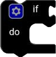
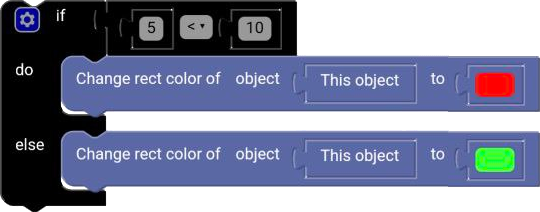

# If block

The `if` block is used to check if a condition is true or false. If the condition is true, the blocks inside the `if` block will be executed. If the condition is false, the blocks inside the `if` block will be ignored.

  

## else

You can modify the `if` block to include an `else` block. The `else` block is executed if the condition in the `if` block is false.

## else if

You can also modify the `if` block to include an `else if` block. The `else if` block is executed if the condition in the `if` block is false and the condition in the `else if` block is true.

## Modify the block

To modify the `if` block, click on the gear icon in the top left corner of the block. This will open the block's settings.

  

## Example

**code :**

  

**result :** 

  

