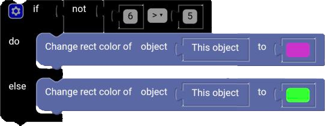
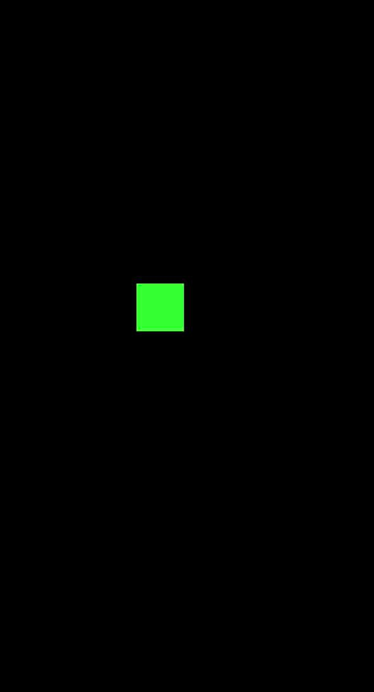

# Not

The `not` block is a boolean (true or false) block that returns the opposite of the value of the input block.

  

**Examples :**

not (6 > 5) => not (true) will return `false`.

not (6 < 5) => not (false) will return `true`.

## Example

**code :**

  

**result :**

  

