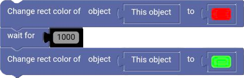
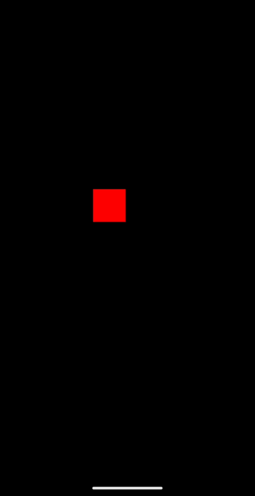

# Wait

The `wait` block is a block that pauses the execution of the event for a certain amount of time (in milliseconds).

  

⚠ Warning !
Be carefull using the `wait` block in the `On Update` trigger as it will not wait between each frame to execute again. You can use it in a if statement (for example) though to delay the execution of a block of code.

## Example

**code :**

  

**result :**

  