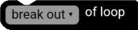
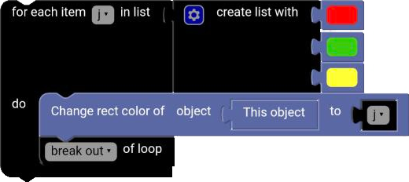
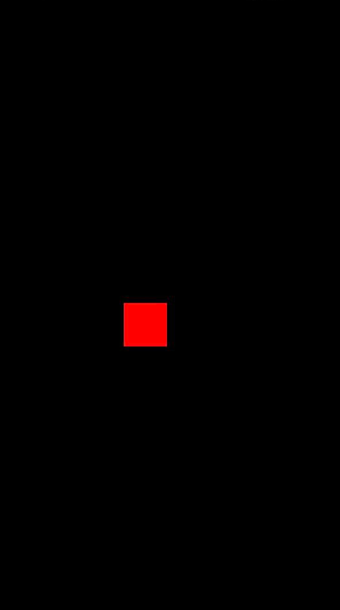

# Break Block

The `break` block is a block that allows you to exit a loop early. The `break` block can only be used inside a loop block. When the `break` block is executed, the loop will stop executing and the program will continue executing the blocks after the loop.

  

## Continue

The `break` block can be converted into a `continue` block to skip the rest of the loop and continue with the next iteration instead of exiting the loop.

## Example

**Code:**

  

**Result:**

  

