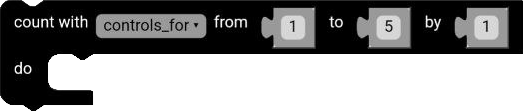
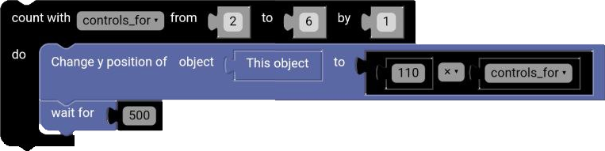

# For Block

The for block is a block that repeats a set of blocks a specified number of times. The for block is similar to the repeat block, but it allows you to use a variable to keep track of the number of times the blocks have been repeated.

  

## Example

**Code:**

  

**Result:**

  

