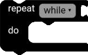
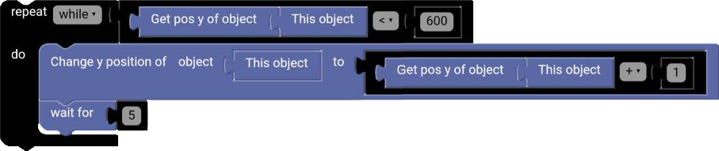

# While Block

The `while` block allows you to repeat a set of blocks as long as a condition is true.

  

## Until

The `while` block can be turned into an `until` block so that the set of blocks is executed at least once before the condition is checked.

## Example

**Code:**

  

**Result:**

  