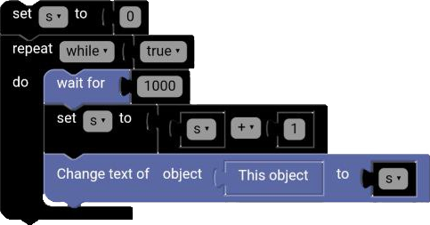

# Arithmetic Binary Block

The `Arithmetic Binary` block is used to perform arithmetic operations such as addition, subtraction, multiplication, ... on two numbers.

  

## +

The `+` block is used to add two numbers together.

**Examples:**

5 + 3 = 8

2 + 7 = 9

## -

The `-` block is used to subtract one number from another.

5 - 3 = 2

7 - 2 = 5

## x

The `x` block is used to multiply two numbers together.

5 x 3 = 15

2 x 7 = 14

## ÷

The `÷` block is used to divide one number by another.

6 ÷ 3 = 2

8 ÷ 2 = 4

## ^

The `^` block is used to raise a number to a power.

2 ^ 3 = 8

3 ^ 2 = 9

## Example

**Code:**

  

**Result:**

  

