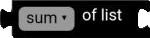
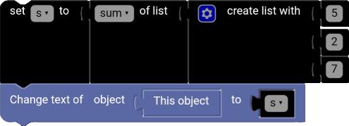
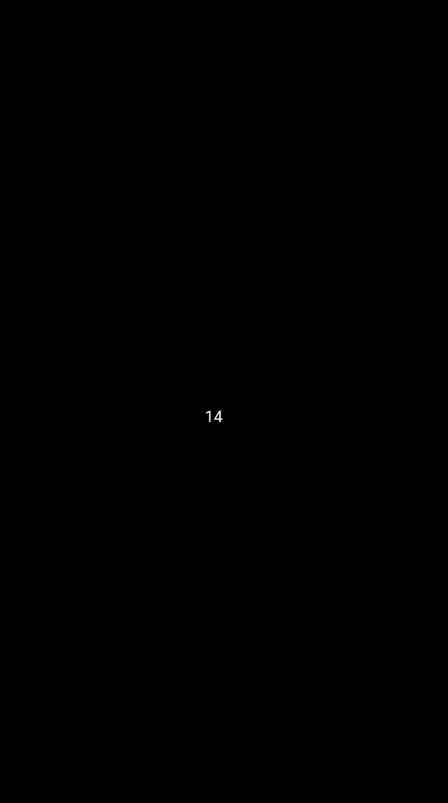

# Arithmetic List

The `Arithmetic List` block is used to perform arithmetic operations such as addition, subtraction, multiplication, ... on a list of numbers.

  

## sum

The `sum` block is used to add all the numbers in a list together.

**Example:**

[1, 2, 3, 4] = 10

[5, 6, 7, 8] = 26

## min

The `min` block is used to find the smallest number in a list.

[1, 2, 3, 4] = 1

[5, 6, 7, 8] = 5

## max

The `max` block is used to find the largest number in a list.

[1, 2, 3, 4] = 4

[5, 6, 7, 8] = 8

## average

The `average` block is used to find the average of all the numbers in a list.

[1, 2, 3, 4] = 2.5

[5, 6, 7, 8] = 6.5

## median

The `median` block is used to find the median of all the numbers in a list.

[1, 2, 3, 4] = 2.5

[5, 6, 7, 8] = 6.5

## modes

The `modes` block is used to find the mode(s) of all the numbers in a list, which is the number(s) that appear most frequently.

[1, 2, 2, 3, 4] = [2]

## standard deviation

The `standard deviation` block is used to find the standard deviation of all the numbers in a list.

[1, 2, 3, 4] = 1.29

[5, 6, 7, 8] = 1.29

## random item

The `random item` block is used to select a random item from a list.

[1, 2, 3, 4] = 2

[5, 6, 7, 8] = 6

## Example

**Code:**

  

**Result:**

  

