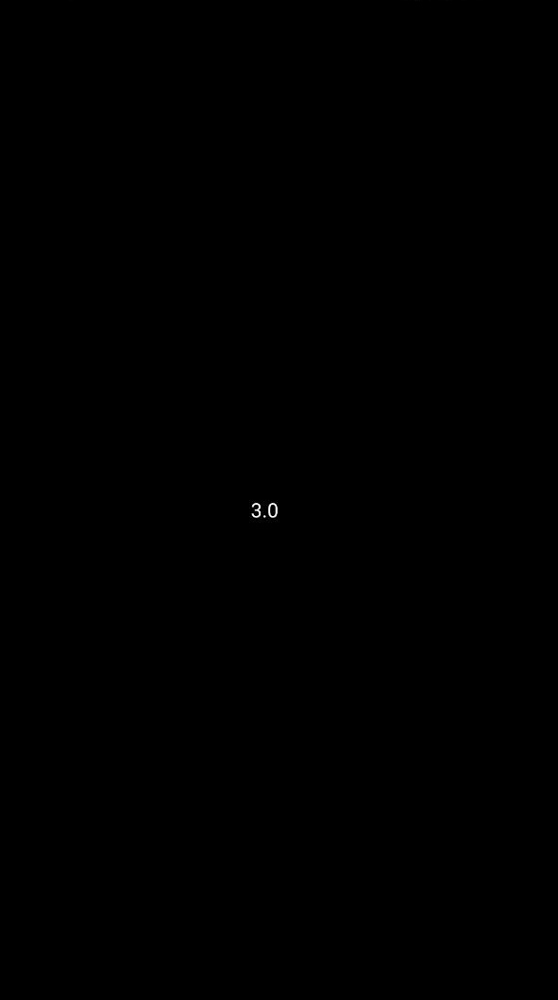

# Arithmetic Unary

The `Arithmetic Unary` block is used to perform arithmetic operations such as negation, absolute value, ... on a number.

  

## square root

The `square root` block is used to find the square root of a number.

**Examples:**

√9 = 3

√16 = 4

## absolute

The `absolute` block is used to find the absolute value of a number.

-5 = 5

7 = 7

## -

The `-` block is used to negate a number.

-5 = 5

7 = -7

## ln

The `ln` block is used to find the natural logarithm of a number.

**Examples:**

ln(1) = 0

## log10

The `log10` block is used to find the base 10 logarithm of a number.

**Examples:**

log10(100) = 2

## e^

The `e^` block is used to raise the constant e to a power.

**Examples:**

e^0 = 1

e^1 = 2.71828

## 10^

The `10^` block is used to raise 10 to a power.

**Examples:**

10^0 = 1

10^1 = 10

## Example

**Code:**

  

**Result:**

  

