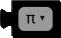
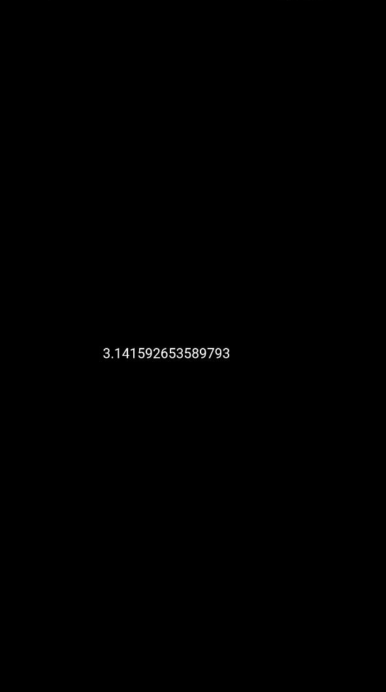

# Constants Block

The Constants block is a block that allows you to use a constant value in your code.

  

## π

The `π` constant is a mathematical constant that represents the ratio of a circle's circumference to its diameter, which is approximately equal to 3.14159.

## e

The `e` constant is a mathematical constant that represents the base of the natural logarithm, which is approximately equal to 2.71828.

## φ

The `φ` constant is a mathematical constant that represents the golden ratio, which is approximately equal to 1.61803.

## sqrt(2)

The `sqrt(2)` constant is a mathematical constant that represents the square root of 2, which is approximately equal to 1.41421.

## sqrt(½)

The `sqrt(½)` constant is a mathematical constant that represents the square root of 1/2, which is approximately equal to 0.70711.

## ∞

The `∞` constant is a mathematical symbol that represents infinity.

## Examples

**Code:**

  

**Output:**

  

