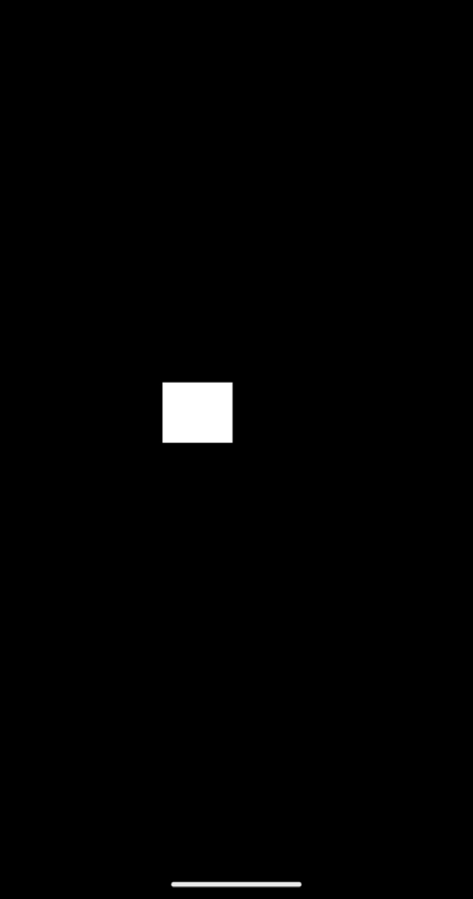

# DeltaTime

The DeltaTime block is a block that allows you to get the time in seconds it took to complete the last frame.

  

⚠ Warning !

Do not use outside of an `On Update` event. That is because only the `On Update` event happens at each frame. It is useless to use it outside of this event.

## Examples

**Code:**

  

**Result:**

  

