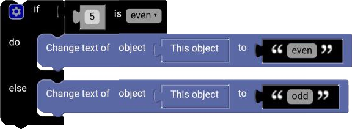

# Number Type

The `Number Type` block is a block that check if a value is a certain type of number, like an even number for example, and returns a boolean value.

  

## even

The `even` type is a type of number that is divisible by 2.

**Examples:**

3 = false

4 = true

## odd

The `odd` type is a type of number that is not divisible by 2.

**Examples:**

3 = true

4 = false

## prime

The `prime` type is a type of number that is only divisible by 1 and itself.

**Examples:**

3 = true

4 = false

## whole

The `whole` type is a type of number that is not a fraction.

**Examples:**

3 = true

4.6 = false

## positive

The `positive` type is a type of number that is greater than 0.

**Examples:**

3 = true

-4 = false

## negative

The `negative` type is a type of number that is less than 0.

**Examples:**

3 = false

-4 = true

## divisible by

The `divisible by` type is a type of number that is divisible by a certain number.

**Examples:**

6 is divisible by 3 = true

7 is divisible by 3 = false

## Example

  

**Result:**

  

