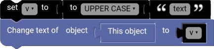

# Case Block

The case block can change the case of the text. It can change the text to uppercase, lowercase, or title case.

  

## UPPER CASE

The upper case block changes the text to uppercase.

**Examples:**

`hello` ➞ `HELLO`

## lower case

The lower case block changes the text to lowercase.

**Examples:**

`HELLO` ➞ `hello`

## Title Case

The title case block changes the text to title case.

**Examples:**

`hello world` ➞ `Hello world`

## Example

**Code:**

  

**Result:**

  

