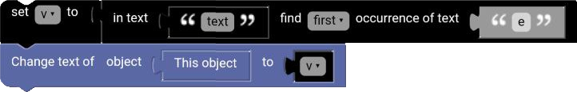

# Find Block

The find block finds the position of a text in another text.

  

## first

The first block finds the position of the first occurrence of a text in another text.

**Examples:**

`hello` in `hello world` ➞ `0`

`world` in `hello world` ➞ `6`

## last

The last block finds the position of the last occurrence of a text in another text.

**Examples:**

`hello` in `hello world hello` ➞ `12`

`world` in `hello world hello` ➞ `6`

## Example

**Code:**

  

**Result:**

  

