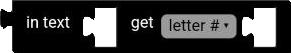
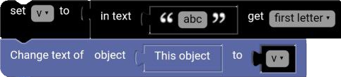
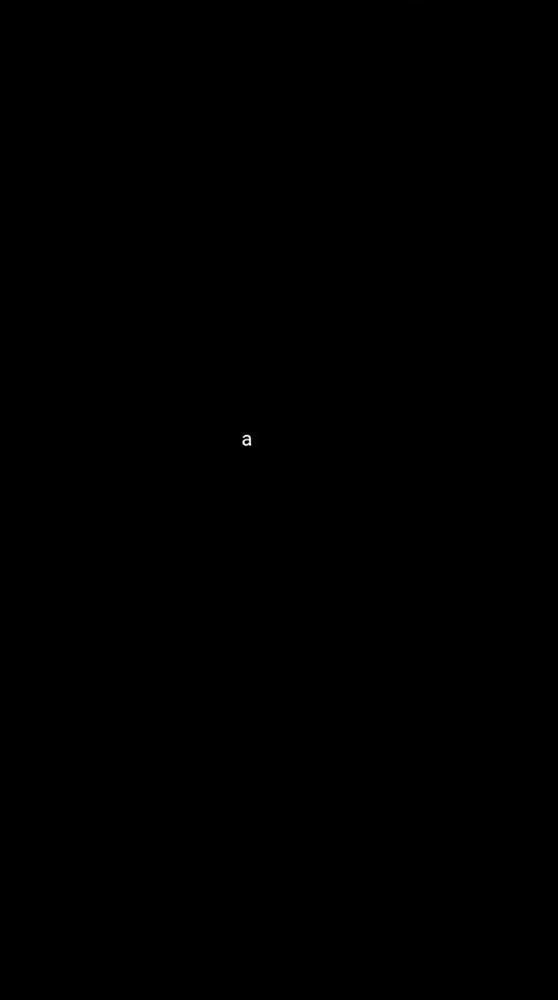

# Get Letter Block

The get letter block gets a letter from a text.

  

## letter #

The letter block gets a letter at a defined index from a text.

**Examples:**

`1` in `hello` ➞ `e`

`0` in `hello` ➞ `h`

`-1` in `hello` ➞ `o`

## letter # from end

The letter block gets a letter at a defined index from the end of a text.

**Examples:**

`1` in `hello` ➞ `o`

`0` in `hello` ➞ `h`

`-1` in `hello` ➞ `e`

## first letter

The first letter block gets the first letter of a text.

**Examples:**

`hello` ➞ `h`

## last letter

The last letter block gets the last letter of a text.

**Examples:**

`hello` ➞ `o`

## random letter

The random letter block gets a random letter from a text.

**Examples:**

`hello` ➞ `l`

## Example

**Code:**

  

**Result:**

  

