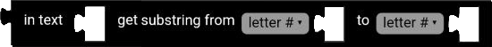
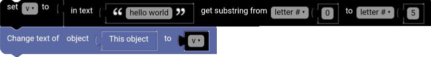
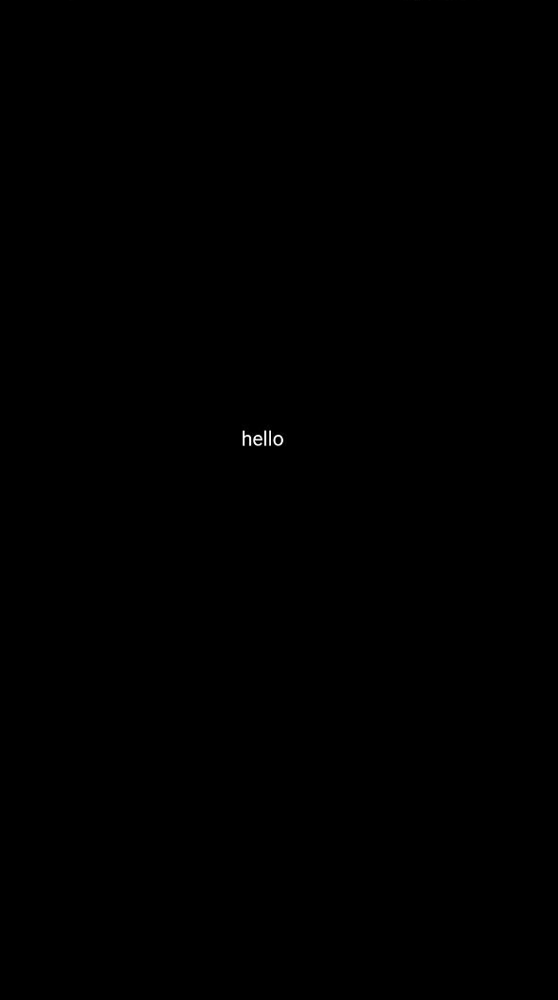

# Substring Block

The substring block gets a substring from a text.

  

## letter #

The letter number to start the substring.

## letter # from end

The letter number to start the substring from the end.

## first letter

The first letter of the substring.

## last letter

The last letter of the substring.

## Example

**Code:**

  

**Result:**

  